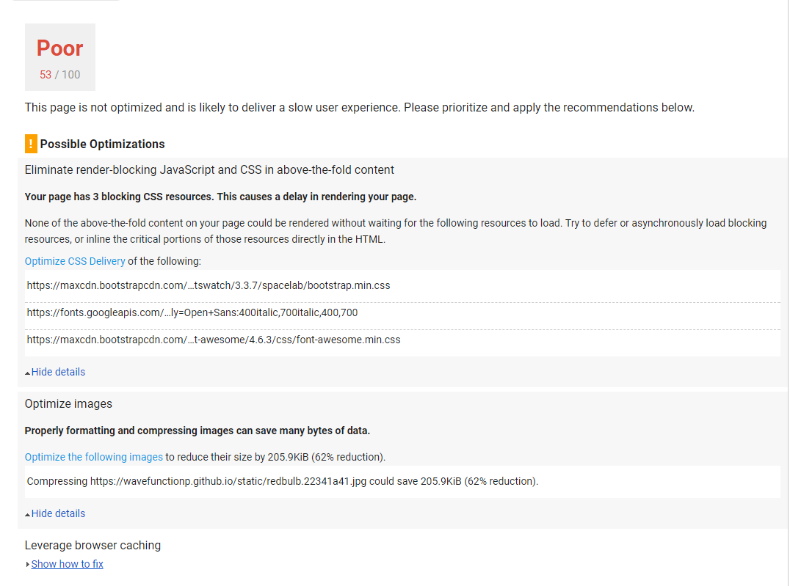

So now with the website converted over the Gatsby. I have been looking into performance. I had been using achor tags, but there is this interesting optimization you can with your internal links to benefit from client side routing. I had seen it mentioned in the docs for gastby, but it didn't click at the time. However, I came across a post by [Scott Nonnenberg](https://blog.scottnonnenberg.com/practical-gatsby-js/) who mentioned that one can avoid a full refresh of the page by utilizing the Link component provided by gatsby, and finally my nagging question was answered as to why my site didn't feel as snappy as the default starter.

With that handled I headed off to [PageSpeed Insights](https://developers.google.com/speed/pagespeed/insights/), which is a tool offer by google to analyze page performance. There are many others, but this one was pretty straitforward, so I just went with it. The lightbulb 'hero image' that I had been using was 4.3MB. which is obviously a lot to be loading on the inital render. I played with it a bit, but google kepts wanting smaller. And I'll admit I was afraid to ending up with a very weak image.

This was the report after an inital attempt:

 //markdown image handling NYI

